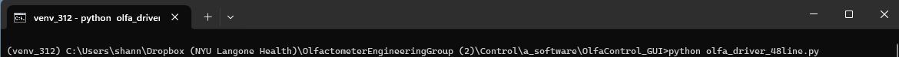
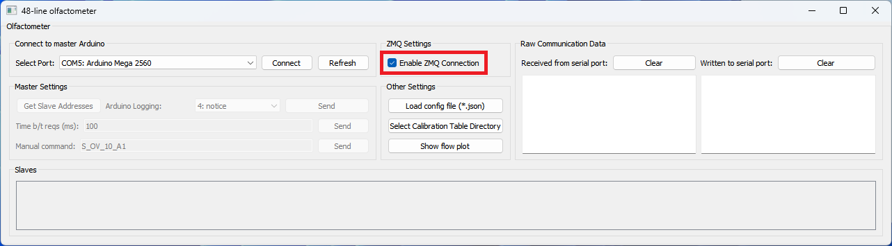

# Voyeur integration

***Note:** Olfa GUI requires python3, so it is recommended to install the GUI in a python3 virtual environment, especially if running Voyeur on python2.*  


# To run the Olfa GUI with Voyeur:

1. **Launch the GUI**  
    In the command prompt, run `python olfa_driver_48line.py`  
    

2. **Connect olfactometer to ZMQ**  
    Select "Enable ZMQ Connection"  
    

3. **Run the Voyeur script**


<br>
<br>


# Things to add to your Voyeur script

## Import ZMQ package and set address

#### What to add:
```python
import zmq
ZMQ_address = "tcp://127.0.0.1:5556"    # Matches the one the olfactometer is set to
```

#### Where:
At top of file, where all the rest of the imports go.  

#### Notes:
You may need to "pip install zmq" for this to work.  
<br>


## Create ZMQ publisher

#### What to add:
```python
try:
    self.zmq_context = zmq.Context()                    # Create a Context (creates sockets)
    self.zmq_socket = self.zmq_context.socket(zmq.PUB)  # Create a socket (type = publisher: sends messages)
    self.zmq_socket.bind(ZMQ_address)                   # Bind the socket to the address
    logger.info("ZMQ socket successfully bound to address: {0}".format(ZMQ_address))
except zmq.ZMQError as e:
    logger.error("Failed to bind ZMQ socket to address: {0}. Error: {1}".format(ZMQ_address, str(e)))
```

#### Where:
In the `__init__` of your `Protocol` class.  

#### Example:
```python
class DMTS_DMD(Protocol):

    def __init__(self, stamp, max_rewards,...):
        super(self.__class__,self).__init__()
        
        '''
        '''
        self.sniffmaxdelay = sniffmaxdelay
        time.clock()

        ##################################
        ## add it here
        try:
            self.zmq_context = zmq.Context()                    # Create a Context (creates sockets)
            self.zmq_socket = self.zmq_context.socket(zmq.PUB)  # Create a socket (type = publisher: sends messages)
            self.zmq_socket.bind(ZMQ_address)                   # Bind the socket to the address
            logger.info("ZMQ socket successfully bound to address: {0}".format(ZMQ_address))
        except zmq.ZMQError as e:
            logger.error("Failed to bind ZMQ socket to address: {0}. Error: {1}".format(ZMQ_address, str(e)))
        ##################################

        self.olfactometers = Olfactometers(self)
        '''
        '''
```


## Add functions `send_ZMQ_STolfa` and `_send_ZMQ_message`

#### What to add:

**send_zmq_STolfa**
```python
def send_zmq_STolfa(self, ostim):
    delay = 0  # in milliseconds
    for olfa, settings in ostim['olfas'].iteritems():
        if settings['odor']:
            setpoint = settings['mfc_flow']
            vial_code = olfa.split('_')[1]
            self.set_point = "S_Sp_{0}_E{1}".format(setpoint, vial_code)

            # Schedule sending command with increasing delay using lambda
            QTimer.singleShot(delay, lambda cmd=self.set_point: self._send_zmq_message(cmd))
            delay += 200  # Increase delay for next command

    delay += 200
    vial_codes_to_open = [olfa.split('_')[1] for olfa, settings in ostim['olfas'].iteritems() if settings['odor']]
    if vial_codes_to_open:
        self.set_open = "S_OV_7_E{0}".format("".join(vial_codes_to_open))

        # Schedule the open command using lambda
        QTimer.singleShot(delay, lambda cmd=self.set_open: self._send_zmq_message(cmd))
```
<br>

**_send_zmq_message**
```python
def _send_zmq_message(self,command):
    logger.info("Sending open vial command over ZMQ: {0}".format(command))
    self.zmq_socket.send_pyobj(command)
```
<br>

#### Notes for `send_zmq_STolfa`:
- To determine which vials to update, it checks which ones have `odor` set to `True`
- The olfa letter in `self.set_point` ("*E*" in this example) must be changed to match the letter of the olfa that is connected
- The duration of vial open in `self.set_open` ("*7*" in this example) may need to be changed
- ~Need to investigate the delay situation going on here~

<br>

#### Where:
Anywhere within your `Protocol` class.  
(May be most convenient to do so right after the definition of `set_olfa_stimulus`)

<br>

## Replace `set_stimulus` with `send_zmq_STolfa`

#### What to add
Comment out `self.olfactometers.set_stimulus()`  
Replace it with `self.send_zmq_STolfa(self.currentstim.olfa_stim_dict)`

#### Where
Within the function `set_olfa_stimulus` (in your `Protocol` class)

#### Example:

```python
def set_olfa_stimulus(self):
    if not self.start_label == 'Start' and not self.pause_label == "Unpause":
        #completed = self.olfactometers.set_stimulus(self.currentstim.olfa_stim_dict)
        self.send_zmq_STolfa(self.currentstim.olfa_stim_dict)
```

#### Notes
We may have to do this in a lot of different places, tbd

<br>

## Generate the stimulus list

This one is tricky lol

<br>

## Send another command to close the vials

TBD if we need to integrate this.  If the "vial open" duration is constant for all trials, we can just hard code it into `send_zmq_STolfa`.