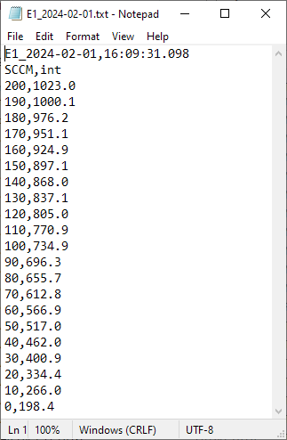
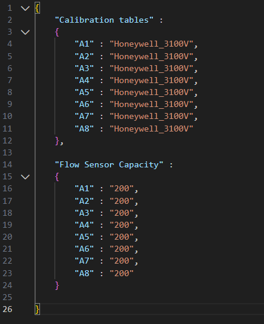
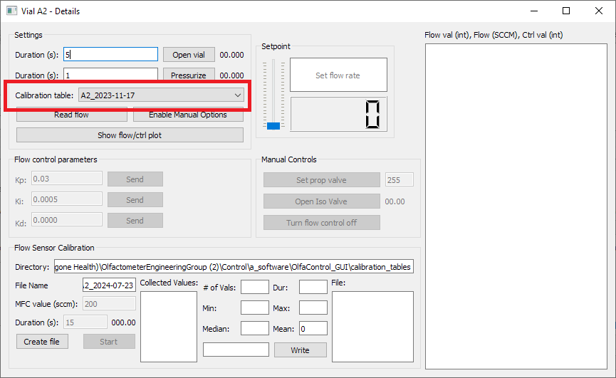
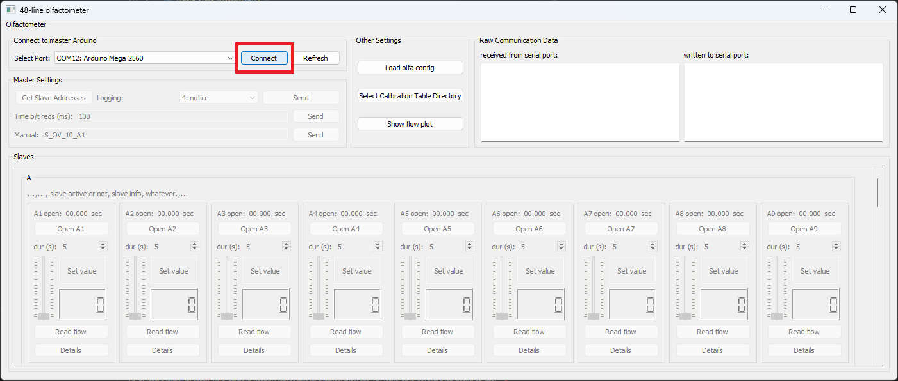

# OlfaControl_GUI

Python GUI for using the new 8-line olfactometer and mixing chamber  

([Hardware Setup](https://github.com/tooles01/OlfaControl_Electronics))

<br>

## Python versions

Update 4/29/2024: GUI is currently compatible with Python 3.9, 3.10, 3.12  
<br>

## Setup

1. Download/clone this folder
    - It is recommended to do so via [Github Desktop](https://docs.github.com/en/desktop/installing-and-authenticating-to-github-desktop/installing-github-desktop) in order to pull new commits (bug fixes/updates) in real time.
    - If not using GitHub Desktop, click the green "<>Code" button above, click "Download ZIP", and save the folder to a directory on your computer.
2. Open the command prompt and navigate to the directory this folder is stored in.
3. *Optional:* Create & activate a virtual environment (instructions below)
4. Install the required packages by entering: ``` pip install -r requirements.txt ``` into the command prompt.
5. Run the GUI: ```python olfa_driver_48line.py```  
    
    (Big Program for running automated stuff/adding PID: ```python main.py```)

<br>

## Calibration tables & Config files

### Calibration tables

To read from each flow sensor, the GUI uses a calibration table to convert the value from voltage to flow rate.

<p align="center"> </p>

Each flow sensor has a slightly different calibration, so it is recommended to use the calibration table for each specific miniMFC to ensure accurate flow control.  
&nbsp;&nbsp;(Further information on calibrating flow sensors can be found [here](https://github.com/tooles01/OlfaControl_Electronics/blob/master/8-line%20Olfactometer/Flow_Sensor_Calibration_Protocol.md).)

<!--
*<p align="center"> *Example calibration table:* </p>*
<p align="center">  </p>
-->

***Note:*** Calibration tables need to be in a folder called **calibration_tables** within the OlfaControl_GUI folder.  


### Config files

To load these calibration tables into the GUI, you can use a config file that lists the miniMFCs on your olfactometer and their corresponding calibration tables.  

This allows for quickly loading all tables into the GUI all at once (instead of manually entering in the Vial Details box for each odor line).

*<p align="center"> *Example config file:*  </p>*
<p align="center">  </p>
<br>

With the GUI open, click "Load config file" and select the desired file. (This must be done each time the GUI is closed and reopened.)

<p align="center"> </p>

To confirm that the config file loaded correctly, open up one of the Vial Details boxes and check that the intended calibration table is selected.

<p align="center">  </p>
<br>

<!--
# Using the Olfactometer:
- Connect to the olfactometer (Connect to Arduino)
<p align="center">  </p>

- Load olfa config (*.json) file.
    - This file is specific to your olfactometer, and contains the names of the calibration tables and maximum capacity for each flow sensor.
    - This step is optional, but allows for quickly loading that information into the GUI all at once, instead of manually entering it for each of the 8 vial lines.

<p align="center">  </p>

*<p align="center"> *Example config file:* </p>*
<p align="center">  </p>

<br>
-->

<br>

#
## To create a virtual environment:

A virtual environment is a space separate from your main python install, where you can install just the packages needed for this project without affecting your global python packages.

It's not necessary to create one in order to use this GUI, but if you choose to, don't forget to activate it **each time** before running the GUI.

<br>

1. Open the command prompt and navigate to the directory where you want the environment created. (For this circumstance, you'll probably want that to be the folder that these files are stored in, "OlfaControl_GUI".)

    

2. Create the environment:
    
    ``` python -m venv <name of environment>\ ```  
    
    *Note:* To create an environment using a specific python version:  
    ``` <path to python version> -m venv <name of environment>\ ```  
    
    

3. Activate the virtual environment:  

    ```<name of environment>\scripts\activate.bat```

    

Once in the environment, you'll have access to all of the packages specifically installed there.