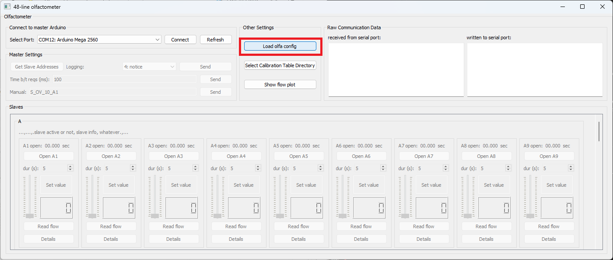
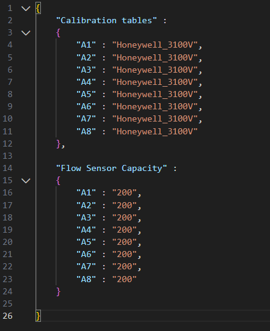
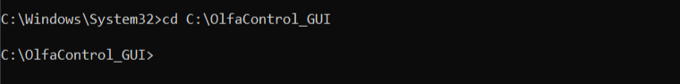
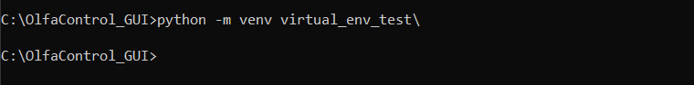
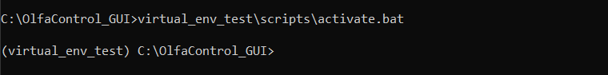

# OlfaControl_GUI

GUI for testing the new 8-line olfactometer

<br>

## Python versions

Update 4/29/2024: GUI is compatible with Python 3.9, 3.10, 3.12  

~~1/23/2024: Python 3.9 and 3.10 work, Python 3.12 does not work~~

<br>

# Setup

1. Download/clone this folder
    - It is recommended to do so via Github Desktop, so you can pull new commits as they happen. (New commits will be bug fixes/etc.)
2. Open the command prompt and navigate to this folder
3. *Optional:* Create & activate a virtual environment (instructions below)
4. Install the required packages: ``` pip install -r requirements.txt ```
5. Run the GUI: ```python olfa_driver_48line.py```  
    
    (Big Program for running automated stuff/adding PID: ```python main.py```)

<br>


## Once you open the GUI:
- Connect to the olfactometer (Connect to Arduino)
<p align="center">
    
</p>

- Load olfa config (*.json) file.
    - This file contains the names of the calibration tables and maximum capacity for each flow sensor.
    - This step is optional, but allows the user to quickly load that information into the GUI all at once, instead of manually entering it for each line.
<p align="center">
    
</p>

<p align="center">
Example config file:
</p>
<p align="center">
    
</p>

<br>

***Note:** Calibration tables should be located in a folder called **calibration_tables** within the OlfaControl_GUI folder. Any new calibration tables must contain values in decreasing sequential order, or the interpolation will get all messed up.*

<br>
<br>

#
### To create a virtual environment:

A virtual environment is a space separate from your main python install, where you can install just the packages needed for this project without affecting your global python packages.

It's not necessary to create one in order to use this GUI, but if you choose to, don't forget to activate it **each time** before running the GUI.

<br>

1. Open the command prompt and navigate to the directory where you want the environment created. (For this circumstance, you'll probably want that to be the folder that these files are stored in, "OlfaControl_GUI".)

    

2. Create the environment:
    
    ``` python -m venv <name of environment>\ ```  
    
    *Note:* To create an environment using a specific python version:  
    ``` <path to python version> -m venv <name of environment>\ ```  
    
    

3. Activate the virtual environment:  

    ```<name of environment>\scripts\activate.bat```

    

Once in the environment, you'll have access to all of the packages specifically installed there.