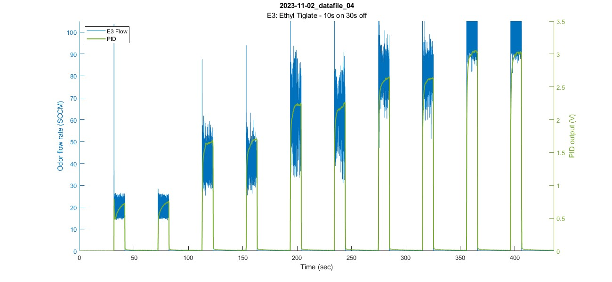

# a_plot_olfa_and_pid
Plot olfactometer & PID data over time

## Syntax
`a_plot_olfa_and_pid(fileName,plot_opts)`  

## Description
`a_plot_olfa_and_pid(filename)` plots the flow and PID data of the given file (over the duration of the trial).  
`a_plot_olfa_and_pid(filename,plot_opts)` plots the given file using the additional plot options specified.  

## Examples

**Default:**  
Plots olfa flow (SCCM) and PID over time  
`a_plot_olfa_and_pid('2023-11-02_datafile_04',pid_lims=[0 3.5]);`  

**Other Options:**
- Plot any combination of 2: flow, ctrl, pid, output flow
- Plot horizontal line at setpoint
- X-lims/scale time

## Function Details
** need to finish  
** need to do something about which can be on which axis  

1. **Adds necessary folders to MATLAB path** (datafiles & functions)  
	

	- Check if current directory contains 'OlfaControl_GUI' (If not, display error message)  
	- Add datafiles to path: *"result_files\48-line olfa"*
	- Add functions to path: *"analysis\functions"*
	

2. **Loads \*.mat file** from *OlfaControlGUI\analysis\data (.mat files)*  

3. **Plots selected data over time**
	- Create/set up figure
		- If selected: Set X limits (`plot_opts.x_lim`)
	
	- If selected: **Plot olfa flow** (`plot_opts.olfa_flow`)  
		(default=yes)
		<!--Vial color based on `plot_opts.colors` variable, hard coded in header -->
		

		
		- For each vial:
			- Get data to plot (SCCM or int) (`plot_opts.flow_in_SCCM`)
			- Set axis options:
				- Set Y-Limits (`plot_opts.flow_lims`)
				- If selected: Scale time (`plot_opts.scale_time`)
				- If selected: Change timescale to minutes (`plot_opts.plot_in_minutes`)
			- **Plot olfa flow**
		

	
	- If selected: **Plot horizontal line at flow setpoints** (`plot_opts.plot_setpoint`)
		

		- For each vial:
			- For each event:
				- Get the setpoint & the start/end times of the OV event.
				- Plot horizontal line at the setpoint.
				
		

		
	- If selected: **Plot olfa ctrl** (`plot_opts.olfa_ctrl`)  
		(default=right yaxis, left yaxis if flow is plotted)
		<!--Vial color based on `plot_opts.c_colors` variable, hard coded in header -->
		

		- For each vial:
			- Get data to plot (int or voltage) (`plot_opts.ctrl_in_V`)
			- Set axis options:
				- If plotting as integer, set Y-Limits (`plot_opts.ctrl_lims`)
				- If olfa flow is plotted: plot ctrl on right yaxis (else, plot on left yaxis) (`plot_opts.olfa_flow`) 
				- If selected: Scale time (`plot_opts.scale_time`)
				- If selected: Change timescale to minutes (`plot_opts.plot_in_minutes`)
			- **Plot olfa ctrl**
		

	
	- If selected: **Plot PID** (`plot_opts.pid`)  
		(default=right yaxis, left yaxis if no flow/ctrl plotted)
		

		- Set axis options:
			- Set Y-Limits (`plot_opts.pid_lims`)
			- If selected: Scale time (`plot_opts.scale_time`)
			- If selected: Change timescale to minutes (`plot_opts.plot_in_minutes`)
		- **Plot PID**
		

	
	- If selected: **Plot output flow sensor** (right yaxis) (`plot_opts.output_flow`)
	- If selected: **Plot calibration value** (left yaxis) (`f.calibration_value`)

## Input Arguments

**fileName - Name of file to be plotted**  
&nbsp;&nbsp;&nbsp;&nbsp;File must have already been parsed using [analysis_get_and_parse_files](analysis_get_and_parse_files.md)

### Data to plot
**olfa_flow - Plot olfa flow data**  
&nbsp;&nbsp;'yes' (default) | 'no'  
**olfa_ctrl - Plot olfa ctrl data**  
&nbsp;&nbsp;'no' (default) | 'yes'  
**pid - Plot PID data**  
&nbsp;&nbsp;'yes' (default) | 'no'  
**output_flow - Plot output flow sensor data**  
&nbsp;&nbsp;'no' (default) | 'yes'  
 

### Units  
**flow_in_SCCM - Plot flow values in SCCM**  
&nbsp;&nbsp;'yes' (default) | 'no'  
&nbsp;&nbsp;&nbsp;&nbsp;Plot flow values in SCCM - if 'no' is selected, integer values will be plotted.  
**ctrl_in_V - Plot ctrl values in V**  
&nbsp;&nbsp;'no' (default) | 'yes'  
&nbsp;&nbsp;&nbsp;&nbsp;Plot ctrl values in V - if 'no' is selected, integer values will be plotted.  
**plot_in_minutes - Plot trial over minutes instead of seconds**  
&nbsp;&nbsp;'no' (default) | 'yes'  
 

### Axis Limits  
**pid_lims - Y-Limits for PID data**  
&nbsp;&nbsp;[0 3] (default) | two-element vector  
**flow_lims - Y-Limits for Olfa flow data (SCCM)**  
&nbsp;&nbsp;[0 105] (default) | two-element vector  
**flow_lims_int - Y-Limits for Olfa flow data (integer)**  
&nbsp;&nbsp;[0 1024] (default) | two-element vector  
**ctrl_lims - Y-Limits for Olfa ctrl data**  
&nbsp;&nbsp;[-5 260] (default) | two-element vector  
 

** need to finish shifting stuff over to input arguments probably
 

### Plot options:
**fig_position - Location and size of figure**  
&nbsp;&nbsp;[166 210 1300 600] (default) | [left bottom width height]  
**legend_on - Display legend on figure**  
&nbsp;&nbsp;'yes' (default) | 'no'  
**flow_width - LineWidth for flow data**  
&nbsp;&nbsp;1 (default) | positive value  
**pid_width - LineWidth for PID data**  
&nbsp;&nbsp;1.5 (default) | positive value  
 

### Other
**x_lim - X-Limits for figure (in seconds)**  
&nbsp;&nbsp;two-element vector  
**scale_time - Shift the data so t=0 at the beginning of the entered x_lims**  
&nbsp;&nbsp;'no' (default) | 'yes'  
**plot_setpoint - Draw a line at the setpoint for the duration of each OV event**  
&nbsp;&nbsp;'no' (default) | 'yes'  

## Dependencies
- get_section_data