# a_plot_on_top
**Plot data from multiple files on top of each other**

Plot a bunch of files on top of each other. can plot by flow value, can do flow v. PID spt char, flow v. ctrl spt char, can handle standard olfa files.  

## Syntax
`a_plot_on_top(file_names,a_title,a_subtitle)` plots the files in the array `file_names`  
<br>

## Examples

### Default:
**Creates Flow vs. PID plot (for multiple files)**  
(with error bars) (plot color for each file is based on vial number)
```
file_names = {'2024-01-09_datafile_02';'2024-01-09_datafile_03';'2024-01-09_datafile_04';'2024-01-09_datafile_05'};
a_plot_on_top(file_names,'1-09-2024','Ethyl Tiglate',pid_lims=[0 3]);
```
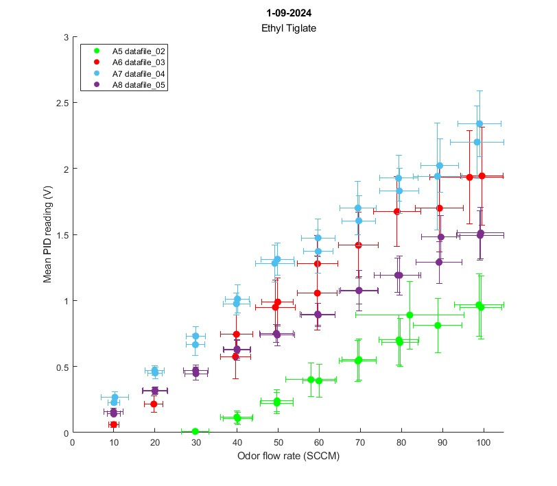

### Additional plots:
<details><summary>Create Flow v. Ctrl plot</summary>
<br>

Set `plot_ctrl` to 'yes'
```
a_plot_on_top(file_names,'1-09-2024','Ethyl Tiglate',pid_lims=[0 3],plot_ctrl='yes');
```
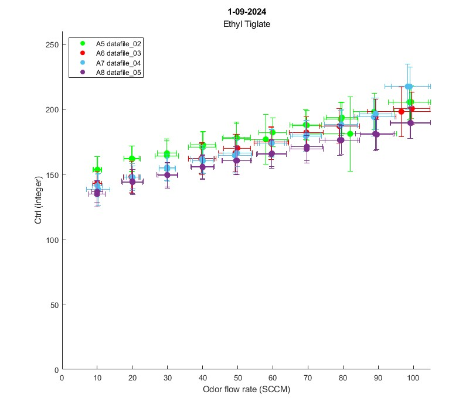
</details>
<br>

<details><summary>Plot each flow rate separately</summary>
<br>

**Plot each flow rate separately:**  
Set `plot_by_flow` to 'yes'
```
a_plot_on_top(file_names,'1-09-2024','Ethyl Tiglate',pid_lims=[0 3],plot_by_flow='yes');
```
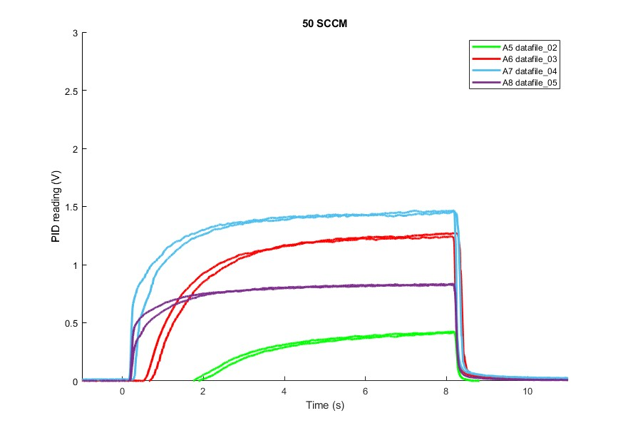
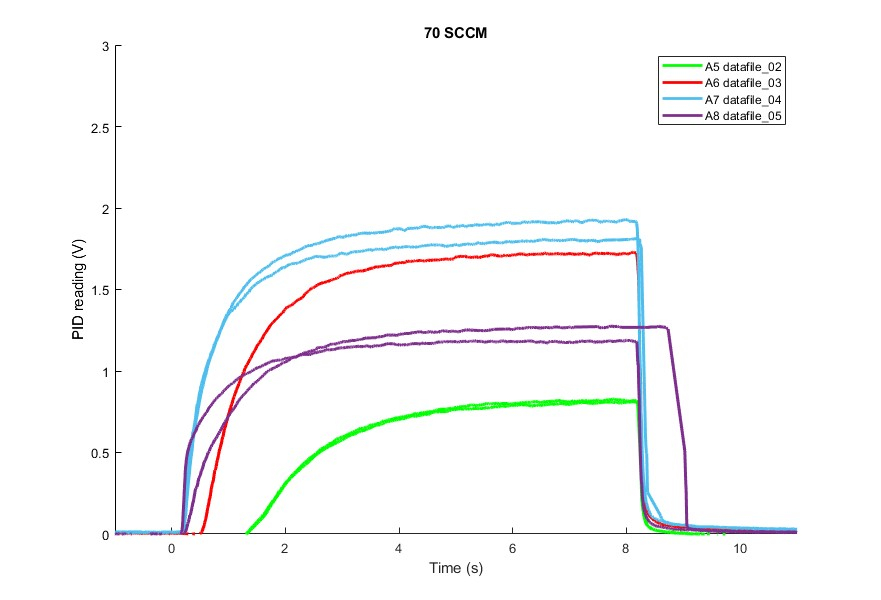
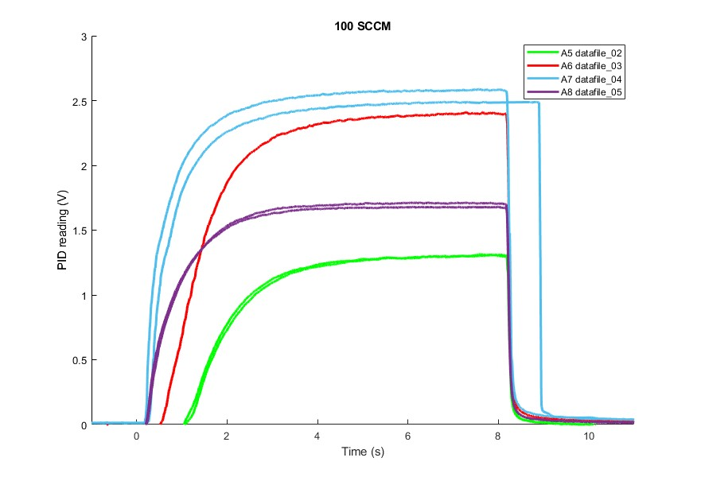

By default, only PID data is shown on individual plots.  
Flow/Ctrl data can be displayed by setting `plot_flow` or `plot_ctrl` to 'yes'. (If both are set to 'yes', they will both be plotted, but ctrl axis is wrong --> need to fix this)
<br><br>

**Show Flow data on individual plots:**  
Set `plot_flow` to 'yes'
```
a_plot_on_top(file_names,'1-09-2024','Ethyl Tiglate',pid_lims=[0 3],plot_by_flow='yes',plot_flow='yes');
```
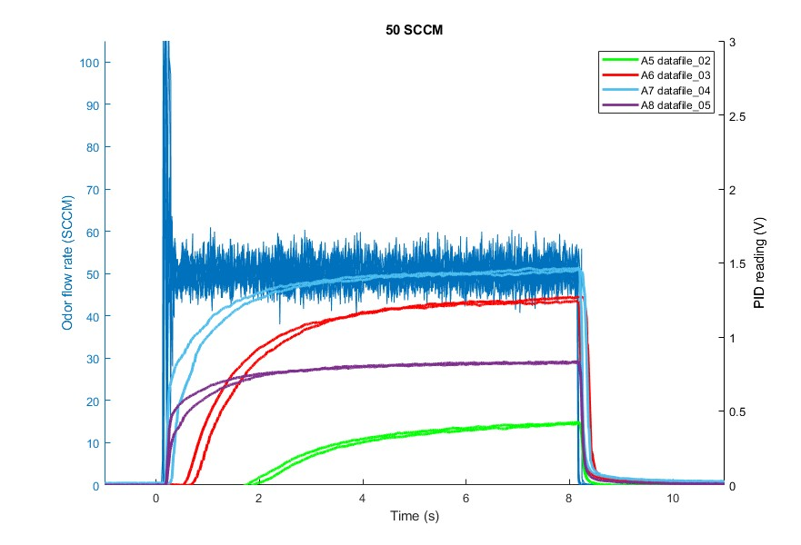
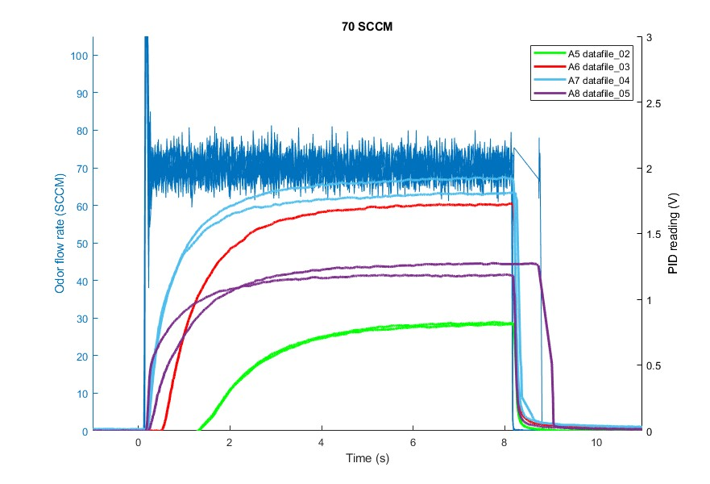
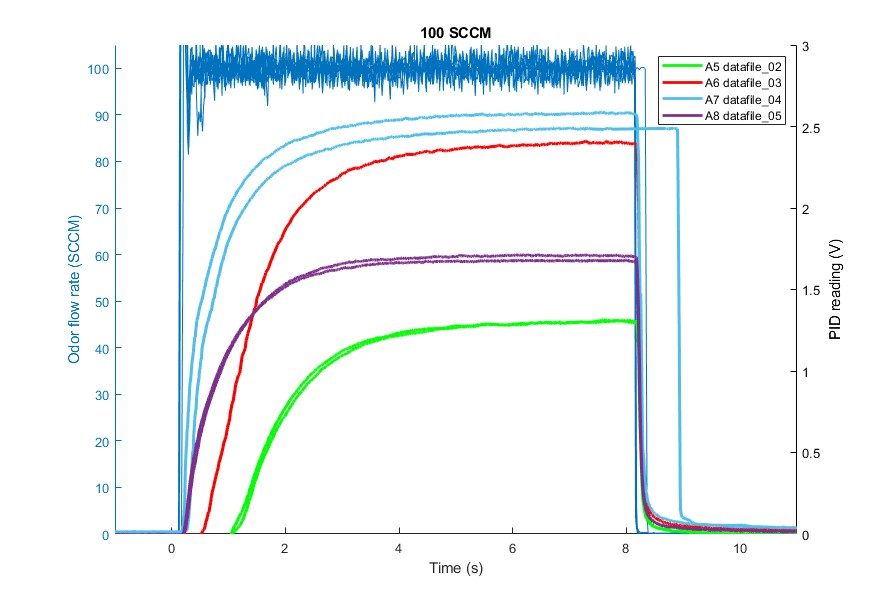
<br><br>

**Show Ctrl data on individual plots:**  
Set `plot_ctrl` to 'yes'
```
a_plot_on_top(file_names,'1-09-2024','Ethyl Tiglate',pid_lims=[0 3],plot_by_flow='yes',plot_ctrl='yes');
```
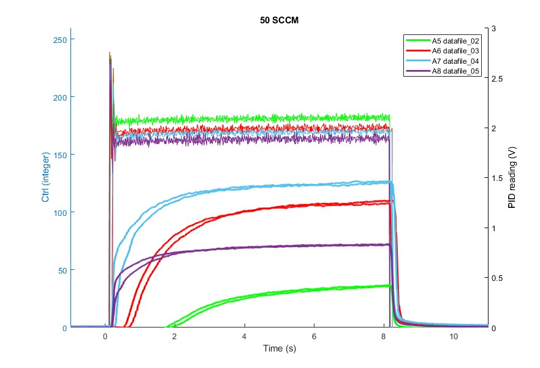
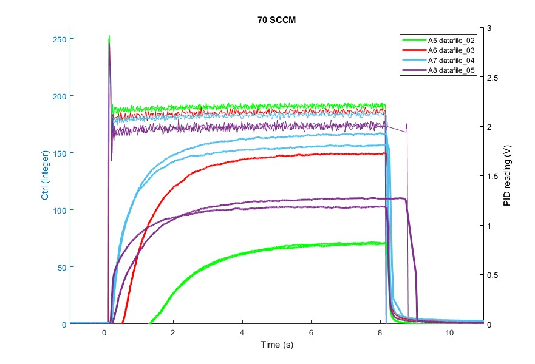
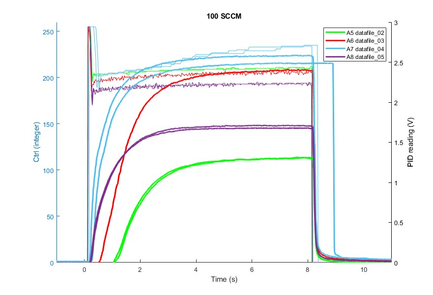
<br>
</details>

## Function Details

1. **Adds necessary folders to MATLAB path** (datafiles & functions)  
	<details>

	- Check if current directory contains 'OlfaControl_GUI' (If not, display error message)  
	- Add datafiles to path: *"result_files\48-line olfa"*
	- Add functions to path: *"analysis\functions"*
	</details>

2. **Loads files in**  
    <details>

    - Preallocate struct array `data`
    - Load the list of files into the array
        - Variables loaded: `d_olfa_data_combined`, `d_olfa_flow`,`data_pid`,`d_olfa_data_sorted`
    </details>

3. **Get list of flow values recorded in these files**  
    <details>

    - For each file:
        - Get list of flow means from each event in this file (from `d_olfa_data_sorted`)
        - Round these values to the nearest 5 & shape into an array
        - Append to the list of `flow_values` from each file
    - Sort the cumulative list of `flow_values`, remove duplicates, now you have every value in these files
    </details>    

4. If selected: **Plots data at each flow rate separately** (`c.plot_by_flow`)  
    <details>
    
    - For each flow value:
        - Create figure
        - For each file:
            - If **8line olfa**:
                - For each vial:
                    - Get all of the flow values we ran trials at
                    - For each trial/event (row in struct):
                        - Get the data (flow, ctrl, pid)
                        - Shift it all to t=0
                        - Plots data
                            - If selected: **Plots ctrl values** on left yaxis (`c.plot_ctrl`)
                            - If selected: **Plots flow values** on left yaxis (`c.plot_flow`)
                            - **Plots PID** on right yaxis
                                - If neither flow nor ctrl are plotted, plot on left yaxis
            - If **Standard olfa**:
                - Get all of the flow values we ran trials at
                - For each trial/event (row in struct):
                    - Get the PID data
                    - **Plots PID** on right yaxis
    </details>

5. **Plots Flow v. PID**  
    and if selected, **Flow v. Ctrl plot** (`c.plot_ctrl`)  
    <details>

    - Create/set up both plots (title, legend, labels, etc)
    - For each file:
        - If **8-line olfa**:
            - For each vial:
                - Get data from `d_olfa_flow.events.OV_keep`
                - For each event: **Cut data & calculate mean/std**
                    - Get (flow, ctrl, PID) data from this event
                    - Cut off the first `c.time_to_cut` seconds
                    - Calculate mean & standard deviation
                    - Add to data structure
                        - `this_file_new_means`     % Array of Flow mean, PID mean (for all trials)
                        - `this_file_new_stds`      % Array of Flow std, PID std (for all trials)
                        - `this_file_ctrl_means`    % Array of Ctrl mean (for all trials)
                        - `this_file_ctrl_stds`     % Array of Ctrl std (for all trials)
                - Put Flow/PID means (`this_file_new_means`) into `data(r).new_means`
                    - (-->It doesn't seem `data(r).new means` is ever used, we only use `this_file_new_means` within this loop, can probably remove this)
                - **Plot Flow v. PID means** (f2)
                    - Add this file's Flow/PID means to f2 (`this_file_new_means`)
                    - If selected:
                        - Shorten file name (`c.shorten_file_name`)
                        - Plot by vial number (`c.plot_by_vial`)
                - If selected: **Plot Flow v. Ctrl means** (f3)
                    - Add this file's Flow/Ctrl means to f3 (`this_file_ctrl_means`)
                    - If selected:
                        - Shorten file name (`c.shorten_file_name`)
                        - Plot by vial number (`c.plot_by_vial`)
                - If selected: **Plot error bars** (`c.plot_error_bars`) *****on by default
                    - For each event:
                        - Get (flow, ctrl, PID) standard deviations from `this_file_new_stds`, `this_file_ctrl_stds`
                        - Divide by 2; Append to `xneg`, `xpos`, `yneg`, `ypos` (divide by 2 so that entire length of the error bar = 1 standard deviation)
                    - **Plot Flow/PID error bars** on ax2
                    - If selected: **Plot Flow/Ctrl error bars** on ax3 (`c.plot_ctrl`)
        - If **Standard olfa**:
            - For each event:
                - Get the flow value (No std here because it comes from the Alicat)
                - Get the PID data:
                    - Cut off the first `c.time_to_cut` seconds
                    - Figure out the end time of the trial:
                        - Find the first time the PID drops below 0.1V: the end time of the trial is 0.1s before that. (If PID was below 0.1V the whole time, make it a 4 second trial)
                    - Get PID data just for this trial
                - Calculate mean & standard deviation (from cut data)
                - Add to data structure
                    - `this_file_new_means`     % Array of Flow mean, PID mean (for all trials)
                    - `this_file_new_stds`      % Array of Flow std, PID std (for all trials)
            - Put Flow/PID means (`this_file_new_means`) into `data(r).new_means`
                - --> same as w/ 8-line olfa, can probably remove this part
            - **Plot Flow v. PID means** (f2)
                - Add this file's Flow/PID means to f2 (`this_file_new_means`)
                - If selected: Shorten file name (`c.shorten_file_name`)
            - If selected: **Plot error bars** (`c.plot_error_bars`) *****on by default
                - Get (flow, PID) standard deviations from `this_file_new_stds`
                - Divide by 2; Append to `xneg`, `xpos`, `yneg`, `ypos` (divide by 2 so that entire length of the error bar = 1 standard deviation)
                - **Plot Flow/PID error bars** on ax2
    </details>

## Input Arguments

### Required:
**file_names - Names of files to be plotted**  
&nbsp;&nbsp;(nx1) cell array of file names  
&nbsp;&nbsp;&nbsp;&nbsp;*Note:* Files must have already been parsed using [analysis_get_and_parse_files](analysis_get_and_parse_files.md)  
**a_title - Figure title** (usually the date)  
**a_subtitle - Figure subtitle**  
<br>

### Axis Limits  
*Note: highly recommend entering PID lims  
**pid_lims - Y-Limits for PID data**  
&nbsp;&nbsp;[0 5] (default) | two-element vector  
**flow_lims - Y-Limits for Olfa flow data**  
&nbsp;&nbsp;[0 105] (default) | two-element vector  
**ctrl_lims - Y-Limits for Olfa ctrl data**  
&nbsp;&nbsp;[0 260] (default) | two-element vector  
<br>

### Data Manipulation
**round_to - When getting flow means from file, round them to the nearest 'x'**  
&nbsp;&nbsp;5 (default) | positive integer value  
&nbsp;&nbsp;&nbsp;&nbsp;->When plotting each flow rate, this is used to determine the flow values that will be plotted. (If round_to = 5, the flow values plotted will be 5,10,15,....100. If round_to = 10, the flow values plotted will be 10,20,30,...100.) (Just don't fuck with this for now, leave it at 5.)  

**time_to_cut - Duration (seconds) to cut from beginning of each section**  
&nbsp;&nbsp;0 (default) | positive value  
&nbsp;&nbsp;&nbsp;&nbsp;->Duration (seconds) to cut from the beginning of each section before recalculating stats (mean, standard deviation). This is used to remove the first few seconds from the trial (the period when PID has not yet reached its peak/plateau value)  
<br>

### Plot Options
**plot_error_bars - Show error bars on Flow v. PID and Flow v. Ctrl plots**  
&nbsp;&nbsp;'yes' (default) | 'no'  
**plot_by_vial - Plot color determined by vial #**  
&nbsp;&nbsp;"yes" (default) | "no"  
&nbsp;&nbsp;&nbsp;&nbsp;&nbsp;&nbsp;->Generally, setting this to "no" will only be used when comparing multiple trials of the same vial. Otherwise, you'll want all trials from the same vial to be the same color.
**shorten_file_name - shorten file name in legend**  
&nbsp;&nbsp;'no' (default) | 'yes'  
**fig_position - position of Flow v. PID plot (f2)**  
&nbsp;&nbsp;[260 230 812 709] (default) | four-element vector  
**dot_size - Size of points on scatter plots**  
&nbsp;&nbsp;60 (default) | positive integer  
<br>

### Additional Figures
**plot_by_flow - Plot each flow value individually**  
&nbsp;&nbsp;"yes" (default) | "no"  

**plot_flow - Plot flow values on left yaxis** (8-line olfa)  
&nbsp;&nbsp;'no' (default) | 'yes'  
**plot_ctrl - Plot ctrl values on left yaxis, Display Flow v. Ctrl plot (f3)** (8-line olfa)  
&nbsp;&nbsp;"no" (default) | "yes"  
<br>

## Dependencies
- get_section_data