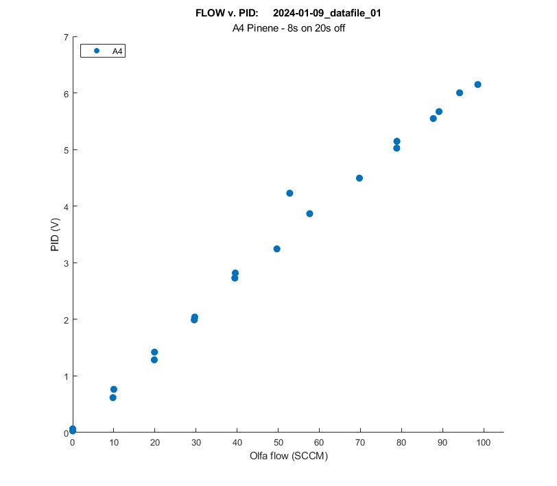
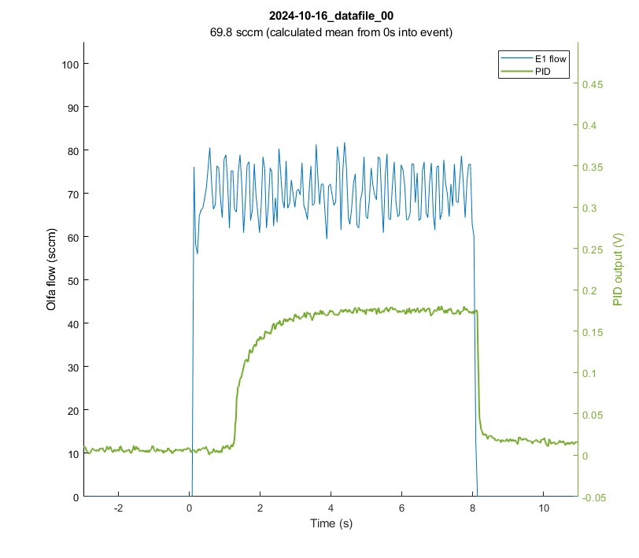
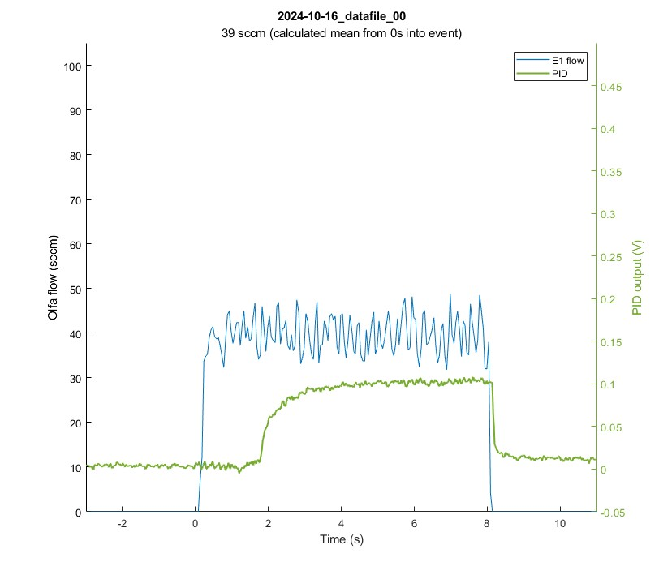
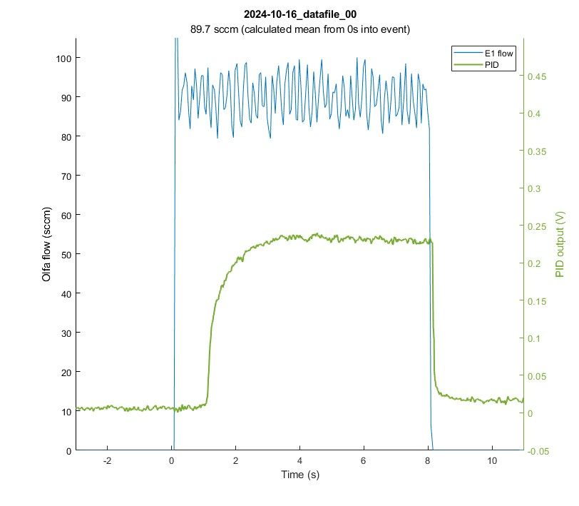
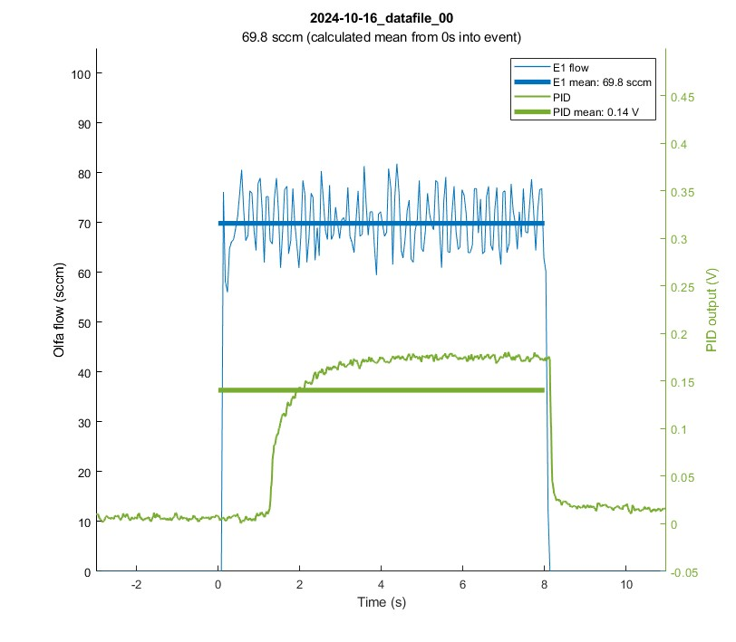
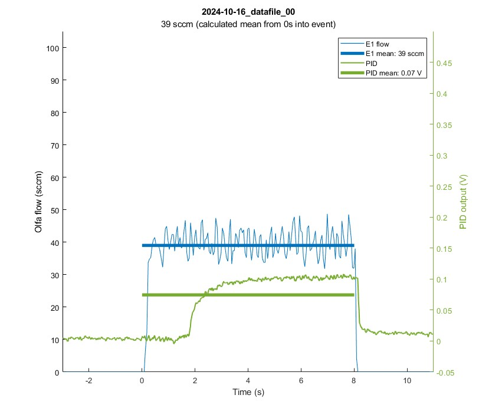
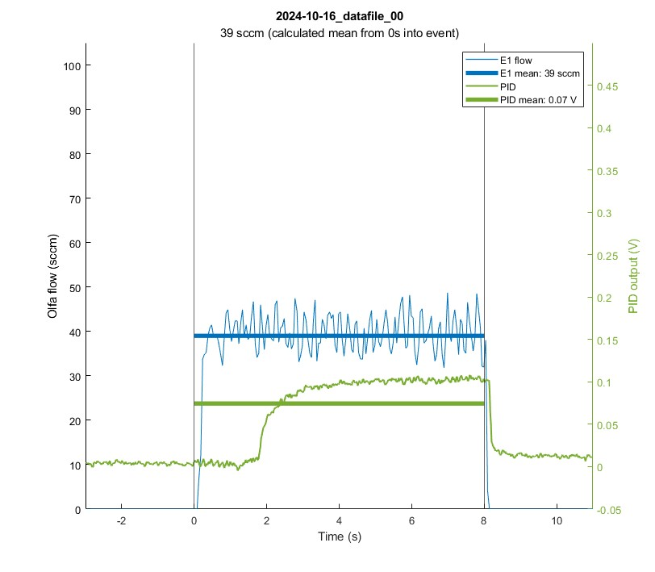
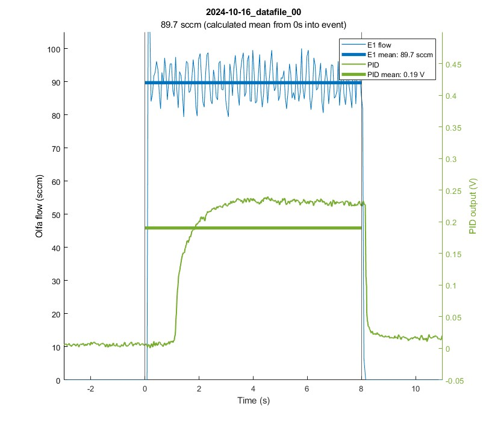

# a_plot_spt_char

## Syntax
`a_plot_spt_char(fileName,plot_opts)`  
 

## Description
`a_plot_spt_char(filename)` plots the setpoint characterization figure (flow vs. PID) of the given file.  
`a_plot_spt_char(filename,plot_opts)` plots the setpoint characterization figure (flow vs. PID) of the given file using the additional plot options specified.  
 
`a_plot_spt_char(filename,over_time,plot_opts)` # tentative
 
 

<!--
Options that always apply:
- time to cut

Default: create single Flow v. PID plot  
Options:
    - 

Can add:  
- plot of entire trial (maybe get rid of this, can just do that in a_plot_olfa_and_pid)  
- individual plots of each event that occurred
    - lots of options here for what we want to show
-->

## Examples

Create Flow vs. PID plot for the given file (default)

 

`a_plot_spt_char('2024-01-09_datafile_01');`

 

Create Flow vs. PID plot AND plot each event in the given file

 

`a_plot_spt_char('2024-10-16_datafile_00',plot_all='yes');`

  
  
  

 

## Input Arguments

 

**fileName - Name of file to be plotted**  
&nbsp;&nbsp;File must have already been parsed using [analysis_get_and_parse_files](analysis_get_and_parse_files.md)

 

### Data to plot:
**olfa_flow - Plot olfa flow data**  
&nbsp;&nbsp;'yes' (default) | 'no'  
**olfa_ctrl - Plot olfa ctrl data**  
&nbsp;&nbsp;'no' (default) | 'yes'  
**pid - Plot PID data**  
&nbsp;&nbsp;'yes' (default) | 'no'  
 

### Units  
**flow_in_SCCM - Plot flow values in SCCM**  
&nbsp;&nbsp;'yes' (default) | 'no'  
&nbsp;&nbsp;&nbsp;&nbsp;Plot flow values in SCCM - if 'no' is selected, integer values will be plotted.  
**ctrl_in_V - Plot ctrl values in V**  
&nbsp;&nbsp;'no' (default) | 'yes'  
&nbsp;&nbsp;&nbsp;&nbsp;Plot ctrl values in V - if 'no' is selected, integer values will be plotted.  
**plot_in_minutes - Plot trial over minutes instead of seconds**  
&nbsp;&nbsp;'no' (default) | 'yes'  
^^^TODO can probably remove  
 

### Axis Limits  
**pid_lims - Y-Limits for PID data**  
&nbsp;&nbsp;[0 7] (default) | two-element vector  
**olfa_lims_sccm - Y-Limits for Olfa flow data**  
&nbsp;&nbsp;[0 105] (default) | two-element vector  
 

### Other
**show_error_bars - Display error bars on Flow vs. PID plot**  
&nbsp;&nbsp;'no' (default) | 'yes'  
 

### Data manipulation
**time_to_cut - Duration (seconds) to cut from beginning of each section**  
&nbsp;&nbsp;0.0 (default) | positive value  
&nbsp;&nbsp;&nbsp;&nbsp;Duration (seconds) to cut from the beginning of each section before recalculating stats (mean, standard deviation). This is used to remove the first few seconds from the trial (the period when PID has not yet reached its peak/plateau value)  
 

### Additional figures:
**plot_over_time - Plot the entire trial over time**  
&nbsp;&nbsp;'no' (default) | 'yes'  
**plot_all - Plot each event individually**  
&nbsp;&nbsp;'no' (default) | 'yes'  
 

### For individual event plots:  
The following options only apply if `plot_all` is set to `'yes'`.  

**plot_x_lines - Plot X-lines marking the region where the mean was calculated from**  
&nbsp;&nbsp;'no' (default) | 'yes'  
**show_pid_mean - Overlay mean PID value on plot**  
&nbsp;&nbsp;'no' (default) | 'yes'  
**show_flow_mean - Overlay mean flow value on plot**  
&nbsp;&nbsp;'no' (default) | 'yes'  

Individual event plots without any overlays

  
  
  

Individual event plots with flow mean and PID mean overlays

  
  
  

Individual event plots with flow mean, PID mean, and X-line overlays

  
  
  

## Function Details
1. **Loads .mat file** (from *OlfaControlGUI\analysis\data (.mat files)*)
2. **Cuts additional time from beginning of each event section** (user specifies how many seconds)
    - Recalculates means & standard deviations (adds them back into the structs)
2. If selected: **Plots entire trial** (flow & PID over time)
3. If selected: **Plots each event section individually**
    - For each vial:  
        - For each OV event:  
            - Create figure  
            - Plot olfa flow
                - Get flow data for this event section, plus 3 seconds before and after (before OV and after CV)  
                - Shift data so OV happens at t=0 & plot the flow data  
                - If selected, plot the flow mean on top
            - Plot PID
                - Get PID data for thie event section, plus 3 seconds before and after (before OV and after CV)
                - Shift data so OV happens at t=0 and plot the PID data
                - If selected, plot the PID mean on top
            - If selected, plot the X-lines
4. **Plots flow v. PID** (mean value over duration of each event)
    - If selected, plot error bars  
 

## Dependencies

- get_section_data

