# a_plot_spt_char

## Syntax
`a_plot_spt_char(fileName,plot_opts)`  
 

## Description
`a_plot_spt_char(filename)` plots the setpoint characterization figure (flow vs. PID) of the given file.  
`a_plot_spt_char(filename,plot_opts)` plots the setpoint characterization figure (flow vs. PID) of the given file using the additional plot options specified.  
 
<!--
`a_plot_spt_char(filename,over_time,plot_opts)` # tentative
 
 
-->

<!--
Options that always apply:
- time to cut

Default: create single Flow v. PID plot  
Options:
    - 

Can add:  
- plot of entire trial (maybe get rid of this, can just do that in a_plot_olfa_and_pid)  
- individual plots of each event that occurred
    - lots of options here for what we want to show
-->

## Examples

### Default:

Create Flow vs. PID plot for the given file

   

  **Default plot:**  
  `a_plot_spt_char('2024-01-09_datafile_01');`
  - Loads .mat file
  - Calculates mean flow/PID for each event (Cuts 0 seconds from beginning/end)
  - Plots flow v. PID  

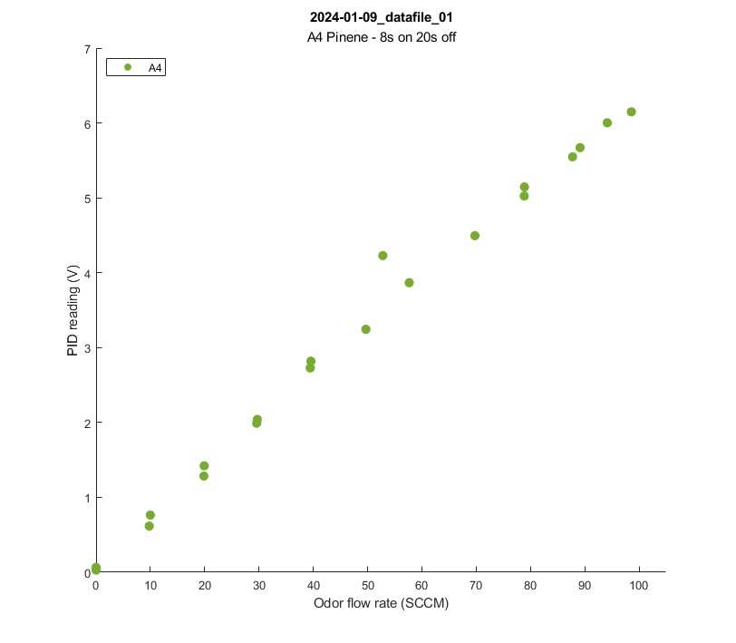
  

  **Show error bars:**  
  `a_plot_spt_char('2024-01-09_datafile_01',show_error_bars='yes');`  
  
  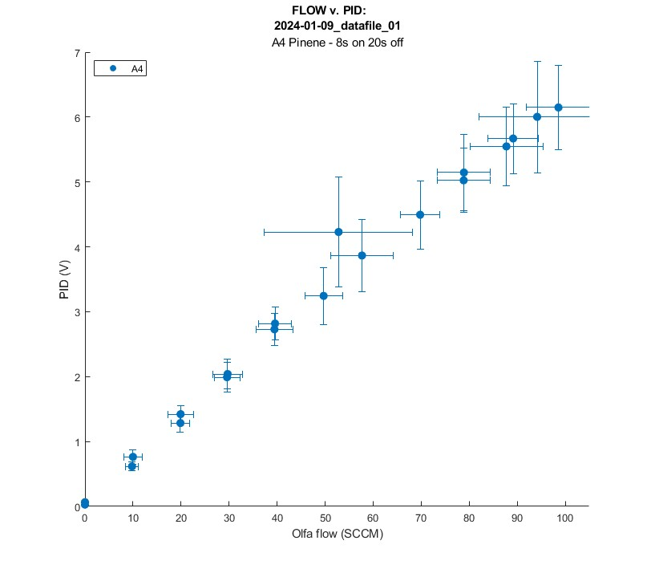

 

### Additional plots:

Plot each event individually

 

**Default:**  
`a_plot_spt_char('2024-10-16_datafile_00',pid_lims=[-.01 .5],plot_all='yes');`  
 
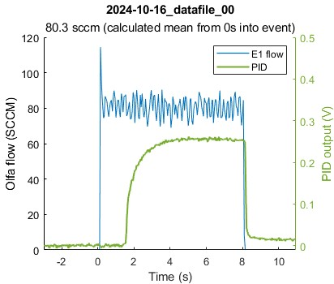
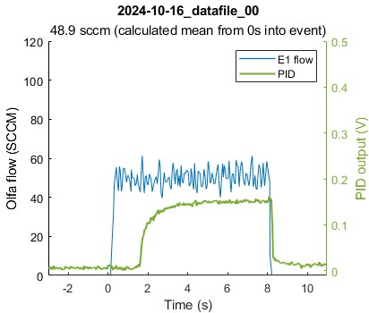
  

**Show calculated flow mean & PID mean on individual plots:**  
`a_plot_spt_char('2024-10-16_datafile_00',pid_lims=[-.01 .5],plot_all='yes',show_flow_mean='yes',show_pid_mean='yes');`  
 
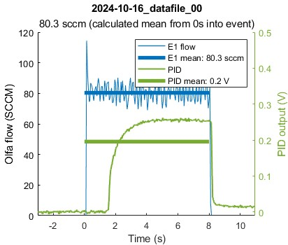
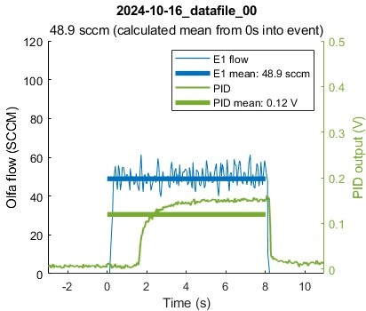
  

**Show calculated flow mean, PID mean, *AND* X-lines on individual plots:**  
X-lines show the timeframe where the mean was calculated from (usually relevant when time has been cut from the beginning of the trial)  
`a_plot_spt_char('2024-10-16_datafile_00',pid_lims=[-.01 .5],plot_all='yes',show_flow_mean='yes',show_pid_mean='yes',show_x_lines='yes',time_to_cut=2);`  
 
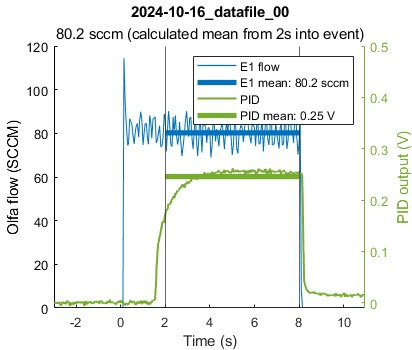
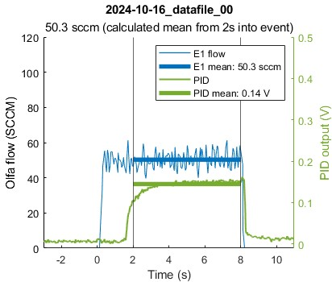
  

Plot entire trial over time

 

`a_plot_spt_char('2024-01-09_datafile_01');`  
 
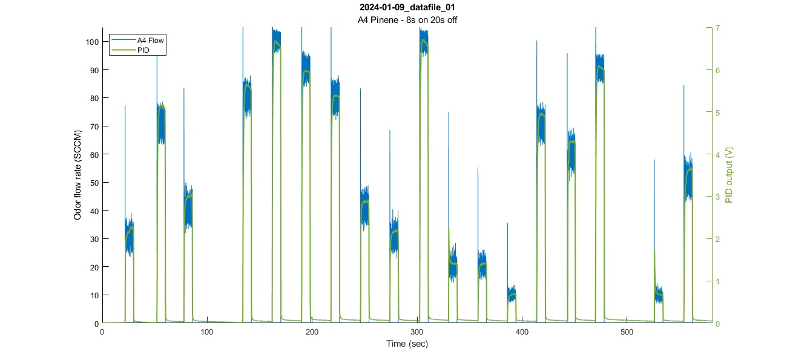

 

## Function Details

1. **Adds necessary folders to MATLAB path** (datafiles & functions)  
	

	- Check if current directory contains 'OlfaControl_GUI' (If not, display error message)  
	- Add datafiles to path: *"result_files\48-line olfa"*
	- Add functions to path: *"analysis\functions"*
	

2. **Loads \*.mat file** from "*OlfaControlGUI\analysis\data (.mat files)*"  

3. **Cuts additional time from beginning of each event section**  
    

    
    - User specifies # of seconds in `plot_opts.time_to_cut`
    - Recalculates means & standard deviations (adds them back into the structs)
    

4. If selected: **Plots entire trial** (flow & PID over time) (`plot_opts.plot_over_time`)  
    

    
    - Create/set up figure
      - If selected: Set X limits (`plot_opts.x_lim`)
    - **Plot olfa flow**
      - For each vial:
        - Plot data (SCCM or int) (`plot_opts.flow_in_SCCM`)
        - Set Y-Limits (`plot_opts.flow_lims`)
    - **Plot PID**
      - Set Y-Limits (`plot_opts.pid_lims`)
    

  
  

5. If selected: **Plots each event section individually** (`plot_opts.plot_all`)  
    

    - For each vial:  
      - For each OV event:  
          - Create figure  
          - **Plot olfa flow**
              - Get flow data for this event section (plus 3 seconds before OV and after CV)  
              - Shift data so OV happens at t=0
              - **Plot flow data**
              - If selected: **Plot the flow mean on top** (`plot_opts.show_flow_mean`)
          - **Plot PID**
              - Get PID data for thie event section (plus 3 seconds before OV and after CV)
              - Shift data so OV happens at t=0
              - **Plot PID data**
              - If selected: **Plot PID mean on top** (`plot_opts.show_pid_mean`)
          - If selected: **Plot X-lines** showing where the mean values were calculated from (`plot_opts.show_x_lines`)
    

      

          
          
      

6. **Plots flow v. PID** (mean value over duration of each event)  
  If selected: **Plots error bars** (`plot_opts.show_error_bars`)
    

    - Create/set up figure
    - For each vial:
      - Plot mean flow v. mean PID (flow as integer or SCCM, `plot_opts.flow_in_SCCM`)
        - Set Y-Limits (`plot_opts.flow_lims_sccm`, `f.flow_lims_int`)
        - Set Marker Color********
        - If selected: **Plot error bars** (`plot_opts.show_error_bars`)
    

  

## Input Arguments

**fileName - Name of file to be plotted**  
&nbsp;&nbsp;File must have already been parsed using [analysis_get_and_parse_files](README_analysis_get_and_parse_files.md)  
 

### Data to plot:
**olfa_flow - Plot olfa flow data**  
&nbsp;&nbsp;'yes' (default) | 'no'  
**olfa_ctrl - Plot olfa ctrl data**  
&nbsp;&nbsp;'no' (default) | 'yes'  
**pid - Plot PID data**  
&nbsp;&nbsp;'yes' (default) | 'no'  
 

### Units  
**flow_in_SCCM - Plot flow values in SCCM**  
&nbsp;&nbsp;'yes' (default) | 'no'  
&nbsp;&nbsp;&nbsp;&nbsp;Plot flow values in SCCM - if 'no' is selected, integer values will be plotted.  
**ctrl_in_V - Plot ctrl values in V**  
&nbsp;&nbsp;'no' (default) | 'yes'  
&nbsp;&nbsp;&nbsp;&nbsp;Plot ctrl values in V - if 'no' is selected, integer values will be plotted.  
**plot_in_minutes - Plot trial over minutes instead of seconds**  
&nbsp;&nbsp;'no' (default) | 'yes'  
<!--^^^TODO can probably remove-->
 

### Axis Limits  
**pid_lims - Y-Limits for PID data**  
&nbsp;&nbsp;[0 3] (default) | two-element vector  
**flow_lims_sccm - Y-Limits for Olfa flow data**  
&nbsp;&nbsp;[0 105] (default) | two-element vector  
 

### Other
**show_error_bars - Display error bars on Flow vs. PID plot**  
&nbsp;&nbsp;'no' (default) | 'yes'  
**fig_position - Location and size of figure**  
&nbsp;&nbsp;[ left bottom width height]  
**legend_on - Display legend on figure**  
&nbsp;&nbsp;'yes' (default) | 'no'  
 

### Data manipulation
**time_to_cut - Duration (seconds) to cut from beginning of each section**  
&nbsp;&nbsp;0.0 (default) | positive value  
&nbsp;&nbsp;&nbsp;&nbsp;Duration (seconds) to cut from the beginning of each section before recalculating stats (mean, standard deviation). This is used to remove the first few seconds from the trial (the period when PID has not yet reached its peak/plateau value)  
 

### Additional figures:
**plot_over_time - Plot the entire trial over time**  
&nbsp;&nbsp;'no' (default) | 'yes'  
**plot_all - Plot each event individually**  
&nbsp;&nbsp;'no' (default) | 'yes'  
 

### For individual event plots:  
The following options only apply if `plot_all` is set to `'yes'`.  

**show_pid_mean - Overlay mean PID value on plot**  
&nbsp;&nbsp;'no' (default) | 'yes'  
**show_flow_mean - Overlay mean flow value on plot**  
&nbsp;&nbsp;'no' (default) | 'yes'  
**show_x_lines - Plot X-lines marking the region where the mean was calculated from**  
&nbsp;&nbsp;'no' (default) | 'yes'  

<!--

More details on individual event plots

#### Default:

#### Flow/PID mean:
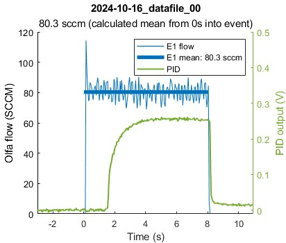
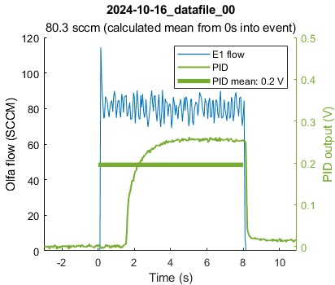

#### X-lines:
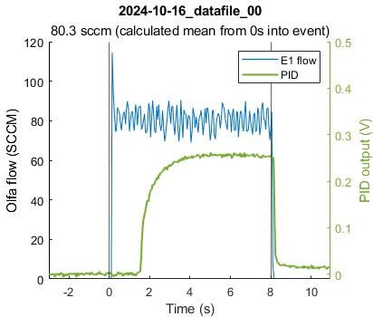
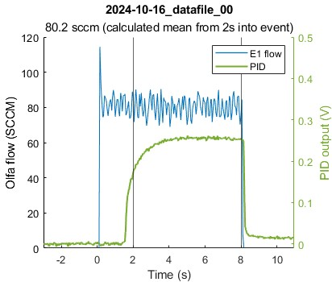

 
-->

## Dependencies
- get_section_data