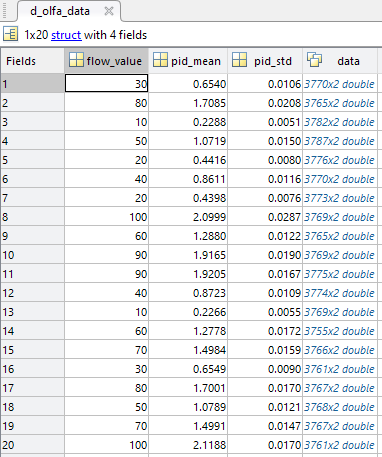
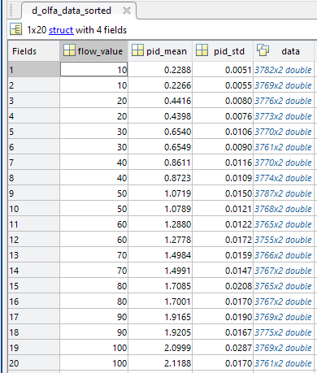
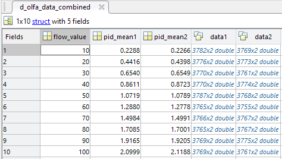

# plot_standard_olfa
**Plot standard olfactometer datafile**

## Description
**Note for me: seems like a combination of analysis_get_and_parse and a_plot_spt_char

## Function Details

-> different file type: (data starts at 4th row of file)  
- Column 1: vial number
- Column 2: flow rate
- Column 3 -> end: PID values (at each time) for that trial
  

1. **Adds necessary folders to MATLAB path**  
	- "*result _files\standard olfa*"
	- "*analysis\functions*"

2. **Sets up display variables**
	- a_this_note
	- flow_inc
	- plot_opts.individual_trials
	- plot_opts.x_lines
	- f.dot_size
	- f.PID_color
	- f.pid_lims
	- f.f_position
	- f.f2_position
	- c.nidaq_freq
	- c.time_to_cut

3. **Loads selected datafile** (from "*OlfaControlGUI\results_files\standard olfa*")  
	*Note:* User must enter datafile name & some other variables
	- Get full directory for this file & read *.csv file
	- Cut out header stuff (remove the top two rows & the first column)

4. **Gets PID baseline value**  
	- Get the minimum PID value recorded during first trial - this will be our new "0"

5. **Adjusts data for each trial/calculate stuff**  
	- Initialize empty data structures
	- For each trial:
		- Adjust PID
			

			
			- Remove missing cells
			- Create array of time values (using *c.nidaq_freq*) so we can create an array (*pid_data*) of [time, PID data] for this trial
			- Shift PID up to 0
		

		
		- **Calculate mean PID value for this trial**
			

			- Cut user-specified # of seconds from the beginning of the trial
				- Get data starting at *c.time_to_cut* seconds into the trial (user-specified # of seconds)
					- If *c.time_to_cut* is less than 2, cut off 2 seconds from beginning anyways
			- Cut end of the trial: 0.1sec before PID drops below 0.1V
				- Find what time the PID drops below threshold (0.1V)
					- If this was a normal trial: End time is 0.1 sec before PID drops below threshold
					- If this was a 0 sccm trial (PID started below threshold value): End time is 4.0 sec after trial begins
			- Get data for this period, calculate mean & standard deviation
		

		
		- If selected: **Plot this trial by itself** (*plot_opts.individual_trials*)  
			- If selected: **Plot x-lines** at beginning and end of where the mean was calculated from (*plot_opts.x_lines*)
		- Add to the data structure (*d_olfa_data*)  
			
			
6. **Creates other data structures**  
	- Sort *d_olfa_data* to create *d_olfa_data_sorted*  
	

	- Add all of that data into *d_olfa_data_combined*  
	

<!--

-->

7. **Saves data structures**  
	- Save *.mat file containing *d_olfa_data_sorted* and *d_olfa_data_combined* to "*OlfaControl_GUI\analysis\data (.mat files)*"
8. **Creates setpoint characterization figure**  

## Dependencies
- get_section_data
