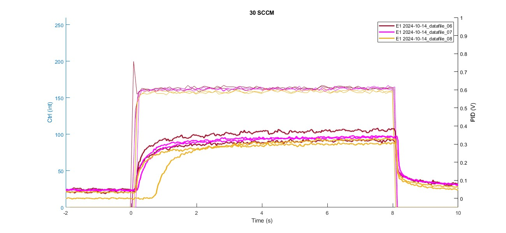

# CAN DELETE - copied over 10/22/2024

# plot_on_top_2023_10_31

***** Not entirely finished but mostly documented

## Syntax:
None because it's not a function

## Description:
Plot a bunch of files on top of each other. can plot by flow value, can do flow v. PID spt char, flow v. ctrl spt char, can handle standard olfa files

## Function Details

1. **Set all of the plot options**

2. **Get datafile names**
    - (n x 1) cell of file names

3. **Set up data**
    - Preallocate struct array called "data"
    
    - Load the list of files into the array  
        - d_olfa_data_combined
        - d_olfa_flow
        - data_pid
        - d_olfa_data_sorted
    
    - Get the list of flow values recorded in these files
        - For each file:
            - For each vial: (shouldn't there only be one?)
                - Get all of the mean flow values (from d_olfa_data_sorted)... and round them to the nearest 5???
            - For standard olf, same shit except variable name for "flow value" is different
        - Sort the list and remove duplicates, now you have every value in these files

4. **Plot each flow value separately**
    - For each flow value:
        - Create figure
        - For each file:
            - Shorten file name (for legend)
            - 8line olfa:
                - Get the rows of the trials at this flow value
                - For each row (trial/event):
                    - Get the data (flow, ctrl, pid)
                    - Shift it all to t=0
                    - Plot ctrl/flow on left yaxis
                    - Plot PID on right yaxis
            - Standard olfa:
                - Get the rows of the trials at this flow value
                - For each row (trial):
                    - Get the pid data & plot it on right yaxis

5. **Flow v. PID and Flow vs. Ctrl plots**
    - Set up plots (title, legend, labels, etc)
    - Plot Flow v. PID for each file
        - 8line olfa:
            - For each vial:
                - Initialize empty structures & get data from d_olfa_flow.events.OV_keep
                - For each event: **Cut data & calculate mean/std**
                    - Get the data (flow, ctrl, pid) (from OV_keep)
                    - Cut the data (Cut off the first *c.time_to_cut* seconds)
                    - Calculate mean & standard deviation (from the cut data) & add them to new data structures
                    - Put the stats into data(r).new_means (It doesn't seem data(r).new means is ever used, we only use this_file_new_means within this loop)
                - **Plot Flow v. PID means** (figure 2)
                    - If selected: shorten file name (c.shorten_file_name)
                    - If selected: plot by vial number (c.plot_by_vial)
                - If selected: **Plot Flow v. Ctrl means** (figure 3)
                    - If selected: shorten file name (c.shorten_file_name)
                    - If selected: plot by vial number (c.plot_by_vial)
                - If selected: **Plot error bars** (c.plot_error_bars)
                    - Initialize empty structures for creating error bars (xneg, xpos, yneg, ypos, yneg_ctrl, ypos_ctrl)
                    - For each event:
                        - Get flow, PID, ctrl standard deviations from the structures you just made before (this_file_new_stds, this_file_ctrl_stds)
                        - Divide by two and add to (xneg, xpos, etc) (divide by 2 so that entire length of the error bar = 1 standard deviation)
                    - Plot flow & PID error bars on ax2
                    - If selected: plot ctrl error bars on ax3 (c.plot_ctrl)
        - Standard olfa:
            - not today

### Plot Options:

#### Axis Limits
**pid_lims - Y-Limits for PID data**  
**flow_lims - Y-Limits for Olfa flow data**  
**ctrl_lims - Y-Limits for Olfa ctrl data**  

 

#### Data Manipulation
**round_to - When getting flow means from file, round them to the nearest x**  
&nbsp;&nbsp;5 (default) | positive integer value  
&nbsp;&nbsp;&nbsp;&nbsp;&nbsp;&nbsp;When plotting each flow rate, this is used to determine the flow values that will be plotted. (If round_to = 5, the flow values plotted will be 5,10,15,....100. If round_to = 10, the flow values plotted will be 10,20,30,...100.) (Just don't fuck with this for now, leave it at 5.)  

time_to_cut - Duration (s) to cut from beginning of event when 

 

#### Plot Options
**plot_by_flow - Plot each flow value individually**  
&nbsp;&nbsp;"yes" (default) | "no"  

**plot_flow - Show flow data on individual flow rate plots**  
&nbsp;&nbsp;"yes" (default) | "no"  

**plot_ctrl - Show ctrl data on individual flow rate plots & Show Flow v. Ctrl plot**  
&nbsp;&nbsp;"no" (default) | "yes"  

1. no ctrl (default) 2. ctrl, no flow 3. no flow, no ctrl

  
  
  

 

plot_error_bars - Show error bars on Flow v. PID

**plot_by_vial - Plot color determined by vial #**  
&nbsp;&nbsp;"yes" (default) | "no"  
&nbsp;&nbsp;&nbsp;&nbsp;&nbsp;&nbsp;Generally, setting this to "no" will only be used when comparing multiple trials of the same vial. Otherwise, you'll want all trials from the same vial to be the same color.

1. no ctrl (default) 2. ctrl, no flow 3. no flow, no ctrl

  
  
  

shorten_file_name

