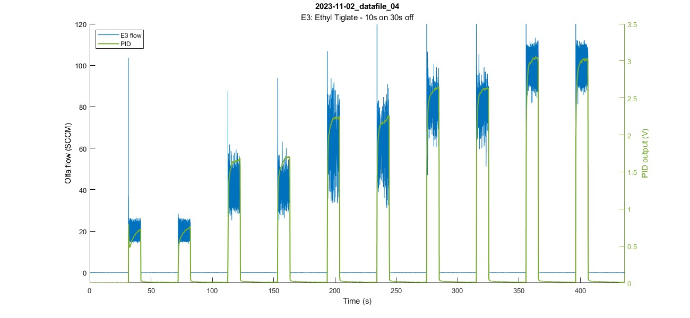

# When running functions, Matlab directory must be '**OlfaControlGUI\analysis'

(*import_datafile.m* will not run otherwise)

 

# Load data files:
## analysis_get_and_parse_files.m
Get raw .csv datafile and save as .mat file.
 

More information [here](Documentation/README_analysis_get_and_parse_files.md)  
 
 

# Plotting:

## a_plot_olfa_and_pid.m
Plot olfactometer & PID data over time  
 

`a_plot_olfa_and_pid(a_thisfile_name)` creates a plot of the data in the given file over time.  
`a_plot_olfa_and_pid(a_thisfile_name,plot_opts)` specifies the plot options.  
 

### Example:
`a_plot_olfa_and_pid('2023-11-02_datafile_04',pid_ylims=[0 3.5]);`

 

More information [here](Documentation/README_a_plot_olfa_and_pid.md)  
 

## a_plot_spt_char.m
Plot setpoint characterization of trial (Flow v. PID plot)  
 

`a_plot_spt_char(filename)` plots the setpoint characterization figure (flow vs. PID) of the given file.  
`a_plot_spt_char(filename,plot_opts)` plots the setpoint characterization figure (flow vs. PID) of the given file using the additional plot options specified.  
 

### Example:
`a_plot_spt_char('2024-01-09_datafile_01');`

 

More details [here](Documentation/README_a_plot_spt_char.md)

