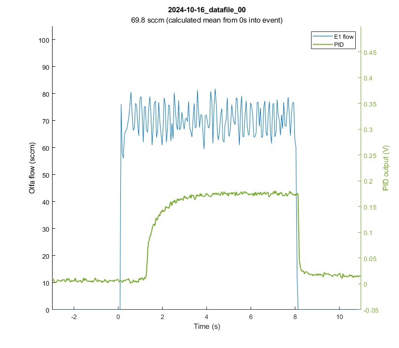
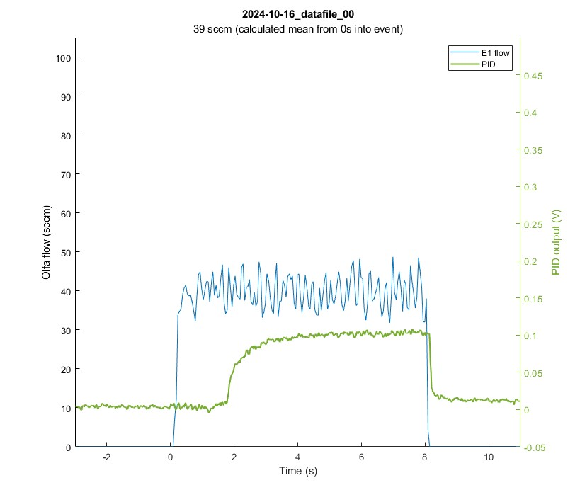
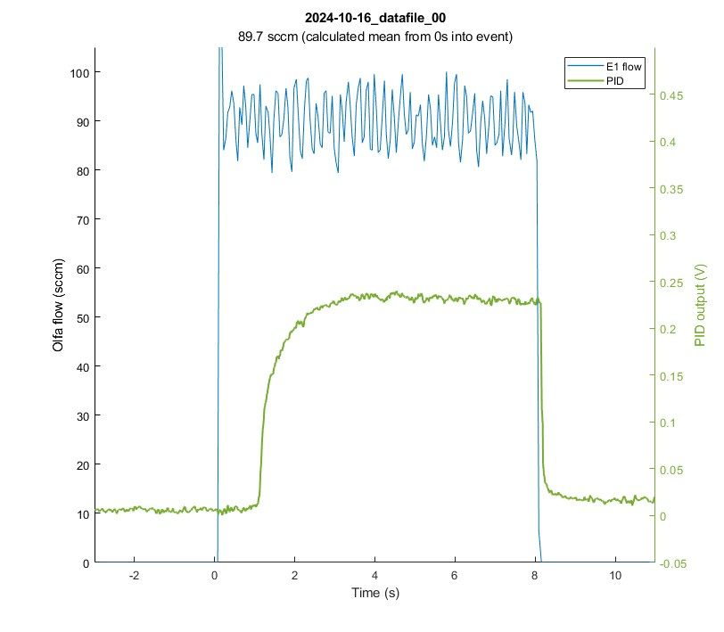
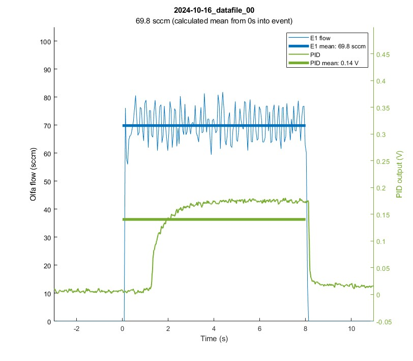
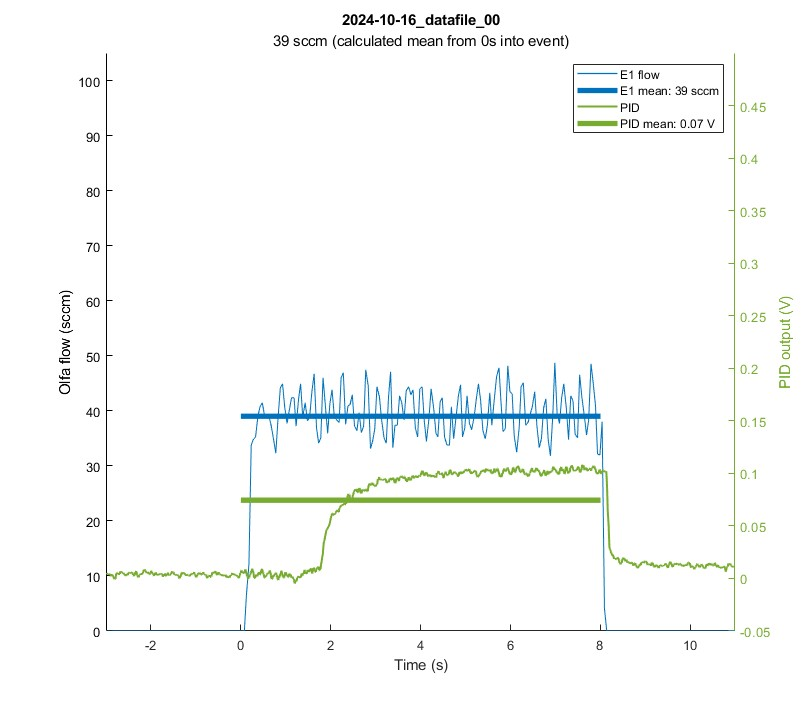
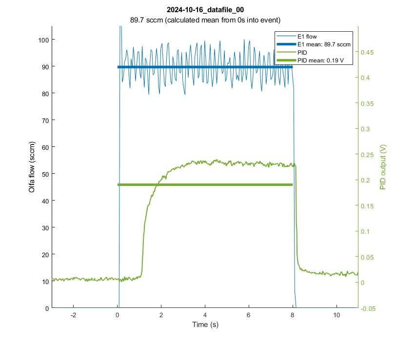
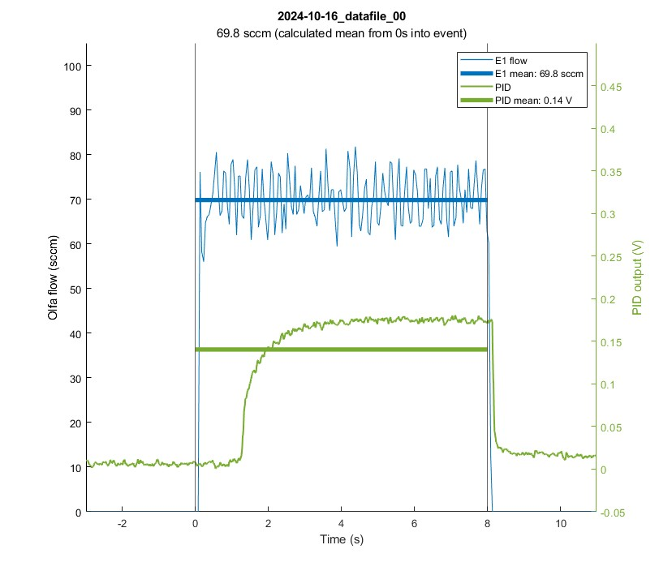
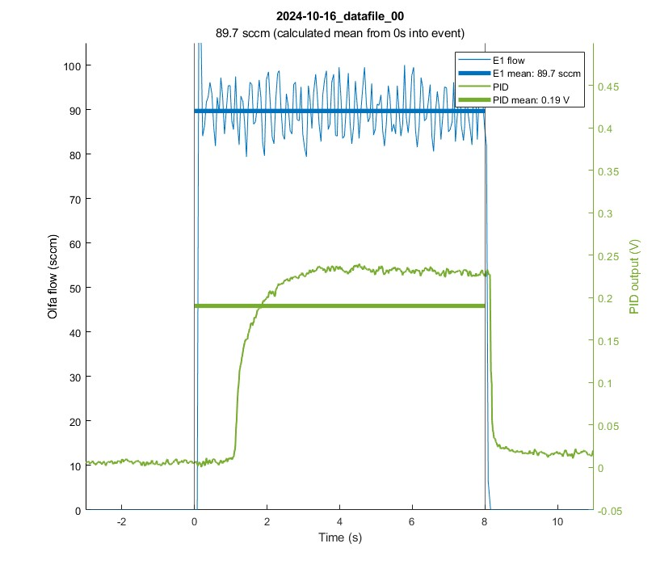

# When running functions, Matlab directory must be '**OlfaControlGUI\analysis'

(*import_datafile.m* will not run otherwise)

 

# Load data files:
### Get raw *.csv datafile and save as *.mat file
**analysis_get_and_parse_files.m**
1. Loads selected datafile (from *OlfaControlGUI\result_files\48-line olfa*)
2. Parses header (PID gain & calibration tables)
	- Imports calibration tables if necessary (from *OlfaControlGUI\calibration_tables*)
3. Adjusts PID (divides by gain & sets baseline to zero)
4. Converts flow values to sccm
5. Converts ctrl values to voltage
6. Smooths PID (moving average over 50ms window)
7. Splits into sections (for each open vial event)
	- For each event (longer than 1 second):
		- Cuts first 50 ms
		- Gets all flow & PID data (& calculates mean)
8. Creates sorted data structure of viable "open vial" events (*d_olfa_data_combined*)
8. Saves .mat file  
 

**Note:**  
User will need to enter **data file name** (line 57).  
--> Optional: Enter a note describing the file (will save to .mat file; is used as caption/description when running plot functions)
 

dependencies:

- get_section_data
- import_cal_table
- import_datafile
- int_to_SCCM

 
 

# Plotting:

## Plot olfactometer data over time
**analysis_plot_olfa.m**
1. Loads .mat file (from *OlfaControlGUI\analysis\data (.mat files)*)
2. Plots olfactometer flow data (over time)  
 

**Note:**  
User will need to enter **data file name** (line 69).  

options:

- flow: plot as int or sccm
- ctrl (proportional valve):
	- plot (or don't) on right yaxis
	- plot as integer or voltage

dependencies:

- *none*

 

## Plot olfactometer & PID data over time
**analysis_plot_olfa_and_pid.m**
1. Loads .mat file (from *OlfaControlGUI\analysis\data (.mat files)*)
2. Plots selected data over time
	- left yaxis: olfa flow
	- right yaxis: user selects one: olfa ctrl, pid, or output flow sensor  
 

**Note:**  
User will need to enter **data file name** (line 63).  

 

options:

- olfa:
	- flow as int or sccm
	- plot ctrl values on right yaxis
		- ctrl as int or voltage
- pid:
	- plot or don't plot
- output flow:
	- plot or don't plot
- time scale in seconds or minutes

dependencies:

- *none*

 

## Plot flow v. PID
**a_plot_spt_char.m** (function)

**Syntax**  
`a_plot_spt_char(fileName,plot_opts)`  
 

**Description**  
`a_plot_spt_char(filename)` plots the setpoint characterization figure (flow vs. PID) of the given file.  
`a_plot_spt_char(filename,plot_opts)` plots the setpoint characterization figure (flow vs. PID) of the given file using the additional plot options specified.  

1. Loads .mat file (from *OlfaControlGUI\analysis\data (.mat files)*)
2. Cuts additional time from beginning of each event section (user specifies how many seconds)
	- Recalculates means & standard deviations (adds them back into the structs)
2. Plots entire trial (flow & PID over time)
3. If selected: plots each event section individually
	- For each vial:  
		- For each OV event:  
			- Create figure  
			- Plot olfa flow
				- Get flow data for this event section, plus 3 seconds before and after (before OV and after CV)  
				- Shift data so OV happens at t=0 & plot the flow data  
				- If selected, plot the flow mean on top
			- Plot PID
				- Get PID data for thie event section, plus 3 seconds before and after (before OV and after CV)
				- Shift data so OV happens at t=0 and plot the PID data
				- If selected, plot the PID mean on top
			- If selected, plot the X-lines
4. Plots flow v. PID (mean value over duration of each event)
	- If selected, plot error bars  
 

Input Arguments:

### Required:

**a_thisfile_name - Name of file to be plotted**  
 

### Data to plot:
**olfa_flow - Plot olfa flow data**  
&nbsp;&nbsp;&nbsp;&nbsp;"yes" (default) | "no"  

**olfa_ctrl - Plot olfa ctrl data**  
&nbsp;&nbsp;&nbsp;&nbsp;"no" (default) | "yes"  

**pid - Plot PID data**  
&nbsp;&nbsp;&nbsp;&nbsp;"yes" (default) | "no"  
 

### Units  
**flow_in_SCCM - Plot flow values in SCCM**  
&nbsp;&nbsp;&nbsp;&nbsp;"yes" (default) | "no"  
&nbsp;&nbsp;&nbsp;&nbsp;&nbsp;&nbsp;&nbsp;&nbsp;&nbsp;&nbsp;Plot flow values in SCCM - if "no" is selected, integer values will be plotted.  

**ctrl_in_V - Plot ctrl values in V**  
&nbsp;&nbsp;&nbsp;&nbsp;"no" (default) | "yes"  
&nbsp;&nbsp;&nbsp;&nbsp;&nbsp;&nbsp;&nbsp;&nbsp;&nbsp;&nbsp;Plot ctrl values in V - if "no" is selected, integer values will be plotted.  

**plot_in_minutes - Plot trial over minutes instead of seconds**
&nbsp;&nbsp;&nbsp;&nbsp;"no" (default) | "yes"  
^^^TODO can probably remove  
 

### Axis Limits  
**pid_lims - Y-Limits for PID data**  
&nbsp;&nbsp;&nbsp;&nbsp;[0 7] (default) | two-element vector  

**olfa_lims_sccm - Y-Limits for Olfa flow data**  
&nbsp;&nbsp;&nbsp;&nbsp;[0 105] (default) | two-element vector  
 

### Other
**show_error_bars - Display error bars on Flow vs. PID plot**  
&nbsp;&nbsp;&nbsp;&nbsp;"no" (default) | "yes"  
**time_to_cut - Duration (seconds) to cut from beginning of each section**  
&nbsp;&nbsp;&nbsp;&nbsp;0.0 (default) | positive value  
&nbsp;&nbsp;&nbsp;&nbsp;&nbsp;&nbsp;&nbsp;&nbsp;&nbsp;&nbsp;Duration (seconds) to cut from the beginning of each section before recalculating stats (mean, standard deviation). This is used to remove the first few seconds from the trial (the period when PID has not yet reached its peak/plateau value)
 

### Additional figures:
**plot_over_time - Plot the entire trial over time**  
&nbsp;&nbsp;&nbsp;&nbsp;"no" (default) | "yes"  
**plot_all - Plot each event individually**  
&nbsp;&nbsp;&nbsp;&nbsp;"no" (default) | "yes"  
 

### For individual event plots:  
The following options only apply if `plot_all` is set to `"yes"`.  

**plot_x_lines - Plot X-lines marking the region where the mean was calculated from**  
&nbsp;&nbsp;&nbsp;&nbsp;"no" (default) | "yes"  
**show_pid_mean - Overlay mean PID value on plot**  
&nbsp;&nbsp;&nbsp;&nbsp;"no" (default) | "yes"  
**show_flow_mean - Overlay mean flow value on plot**  
&nbsp;&nbsp;&nbsp;&nbsp;"no" (default) | "yes"  

Individual event plots without any overlays

  
  
  

Individual event plots with flow mean and PID mean overlays

  
  
  

Individual event plots with flow mean, PID mean, and X-line overlays

  
  
  

 

dependencies:

- get_section_data

 
